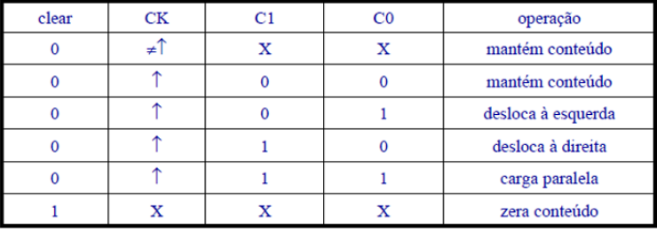

> Status: Complete ✔️

##

Questão 1: Implemente em VHDL um Latch SR da seguinte forma: (a) sem o uso de PROCESS; (b) com o uso de PROCESS. Apresente as formas de ondas resultantes.

Questão 2: Implemente em VHDL um Latch SR com controle usando PROCESS. Apresente as formas de ondas resultantes.

Questão 3: Implemente em VHDL um Latch D com o uso de PROCESS. Apresente as formas de ondas resultantes.

Questão 4: Implemente em VHDL um Flip-Flop D ativado na borda de subida usando PROCESS. Apresente as formas de ondas resultantes.

Questão 5: Implemente em VHDL um Flip-Flop D ativado na borda de descida, com sinais de Reset e Preset ativados em ’0’ usando PROCESS. Apresente as formas de ondas resultantes.

Questão 6: Implemente em VHDL um registrador de 4 bits ativado na borda de subida com os sinais de carga (load) e limpa (clear). Apresente as formas de ondas resultantes.

Questão 7: Descreva em VHDL um registrador de 4 bits com carga paralela controlável que apresente o seguinte comportamento.

