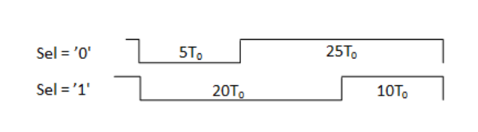
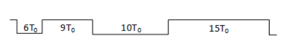

> Status: Complete ✔️

##

### Tarefa 3 – Circuitos Geradores de Sinais e Divisores de Frequência

Questão 1: Gerador de sinal programável de duas janelas - Descreva em VHDL, um circuito gerador de
sinal programável controlado por um sinal de seleção (Sel) capaz de produzir os seguintes sinais de duas janelas:
Sel = ’0’ - 5T e 25T ou Sel = ’1’ - 20T e 10T. Para a solução do problema, considere o uso de Mux e a
possibilidade de uso de dois circuitos geradores de sinais.

Questão 2: Gerador de sinal de quatro janelas - Descreva em VHDL, um circuito cuja entrada é um sinal
de clock (T 0 ) e cuja saída é um sinal com quatro janelas de tempo com as seguintes larguras (da esquerda para
direita): 6T, 9T, 10T, 15T.

Questão 3: Circuito divisor de frequência com fase simétrica - Descreva em VHDL, um circuito divisor
por 13 da frequência de clock de entrada. O circuito deve garantir que o sinal de saída tenha um ciclo de trabalho
de 50% (Duty cycle = 50%), ou seja, saída simétrica.

