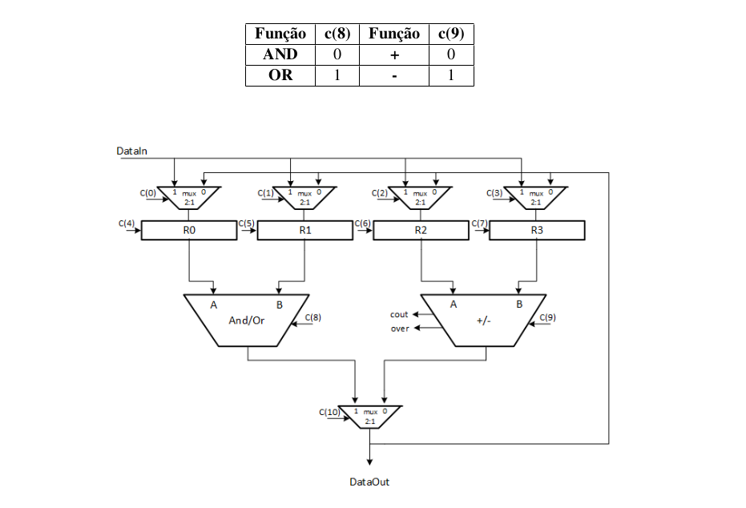

> Status: Complete ✔️

##

### Trabalho Final – Projeto Nível RT

Projete o bloco de operativo (Datapath) apresentado na Figura abaixo:
Considerações:
+ Operandos de 8 bits
+ Números com sinal representados em complemento de 2

Projete o bloco de controle capaz de implementar algoritmos para os problemas propostos: O projeto do bloco de controle deverá possuir os seguintes itens que deverão ser entregues:

+ O algoritmo em alto nível.
+ O algoritmo em termos de registradores.
+ O diagrama de estados com as operações de transferência entre registradores associadas aos estados.
+ A palavra de controle para todas as micro-operações (utilize a notação simbólica e binária).
+ A implementação prática, ou seja, a descrição em VHDL mostrando a validade da solução em forma de ondas .vwf, de acordo com a arquitetura disponibilizada.
+ Dica: para a implementação VHDL, é necessário apenas alterar a FSM com a sequência de palavras de controle previamente definidas.

__OBS.: Apresente um algoritmo que some os números pares existentes no intervalo de 20 a 30. Para isso, leia
esta sequência de valores pela porta de entrada DataIn.__
